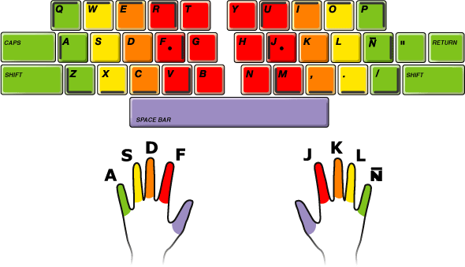
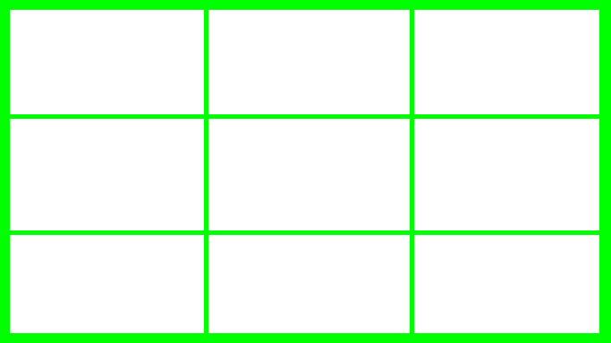
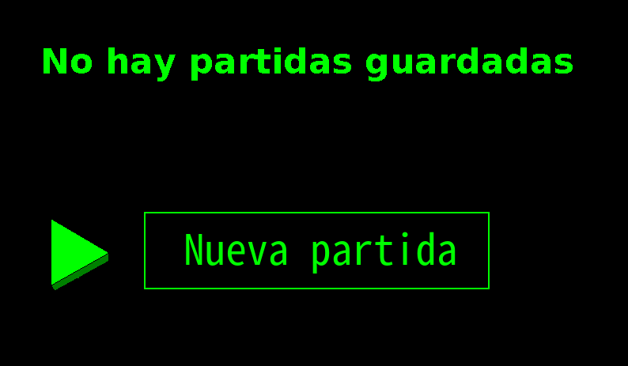
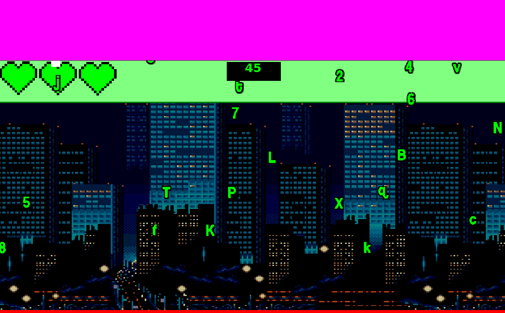

---
title: "1º DAW"
author: [Tarik Said Manjón]
date: "The Typix"
subject: "Markdown"
keywords: [Markdown, Example]
lang: "es"
colorlinks: true
code-block-font-size: '\normalsize'
listings-no-page-break: true
header-includes:
  - |
    ```{=latex}
    \usepackage{awesomebox}
    ```
pandoc-latex-environment:
  noteblock: [note]
  tipblock: [tip]
  warningblock: [warning]
  cautionblock: [caution]
  importantblock: [important]
...

{style="display:block; margin: 0 auto"}

The Typix es un juego didáctico de mecanografía, con un estilo gráfico, banda sonora y narrativa inspirada en la película de culto "The Matrix", hecho integramente con la interfaz gráfica de usuario de Java. Para superar sus cinco niveles, el usuario deberá ser capaz de escribir en un teclado usando las técnicas de mecanografía apropiadas. 

## Guía básica de Juego

::: warning
El juego está diseñado para jugar con una resolución de 1920x1080. Cualquier otra resolución dará errores de posicionamiento de diversos menús, textos e imágenes. De no ser posible cambiar la resolución de la pantalla mediante el SO, deberemos modificar el ancho y el alto de la "ConsolaDAW" a los valores previamente mencionados.
::: 

### Menús principales del juego

Al ejecutar The Typix, lo primero que oíremos será su música, y deberá aparecer el título y pequeño subtítulo que nos indicará que debemos presionar inicio para continuar. 

A continuación aparecerá el menú principal, dónde podremos entre empezar una nueva partida, continuar una de las existentes, o salir del juego. 

::: note
Para movernos entre este menú, o cualquier otro, deberemos utilizar los **números** del teclado, y para elegir una opción, presionar la telcla de **enter**. En ningún menú, ni en ninguna otra parte del juego, se utilizarán las flechas de dirección del teclado.
:::

Si queremos empezar una partida con un nuevo usuario, seleccionaremos la primera opción **Nueva partida**, y podremos introducir un nombre de usuario con hasta 7 letras y/o números. Si presionamos enter, la partida empezará.

Puede haber hasta un máximo de 9 partidas a la vez, las cuáles son guardadas en un archivo JSON. 

En el caso de querer continuar con una partida ya existente, seleccionaremos la opción de **Continuar partida**, y a continuación se nos mostrará un menú con las partidas guardadas y el nivel máximo desbloqueado en ellas. Seleccionaremos (otra vez, mediante el teclado numérico) la partida que deseamos continuar, y nos aparecerá otra pantalla de selección, donde eligiremos entre los niveles disponibles para el usuario en cuestión.

Por último, la opción de salir cierra el juego. 

### Gameplay 

El juego es sencillo: en cada nivel, durante 60 segundos, nos caerán unas letras y/o números (y, en el último nivel, símbolos) desde la parte superior de la pantalla, y deberemos pulsar la misma letra en nuestro teclado para que desaparezca. En el caso de llegar a la parte inferior de la pantalla, perderemos una de las tres vidas que tenemos, y en caso de que estas lleguen a cero, perderemos la partida. 

Durante cualquier momento durante una partida, si pulsamos la tecla **Escape**, podremos ver la ayuda donde se nos indica qué tecla debemos pulsar con cada dedo y como posiconar las manos en el teclado.

{style="display:block; margin: 0 auto"}

## Comentarios sobre el código, metodología empleada y otras observaciones

Durante el desarrollo del juego, han sido diversos los problemas encontrados y sus soluciones. Vamos a ver las principales clases y métodos empleados, teniendo en cuenta las herramientas y los conocimientos de los que disponemos. 

### Menús principales

Las imágenes que forman los menús han sido hechas a mano con una herramienta de edición similar a Paint. Cada menú tiene su clase particular, y la mayoría de clases comparten ciertas características:

- Tener un atributo int que representa la opción que estamos señalando en ese momento, y cambia al cambiar de opción. De este modo, podemos definir que elección está haciendo el usuario.

- Tener un atributo booleando de "done", "state" o algún similar, que nos indicará el momento en el que hemos finalizado de utilizar dicho menú.

- Un atributo Sprite o Image, que utilizaremos para cargar la imágen del menú en cuestión.

Otra característica de los menús en "The Typix" esque suelen estar acompañados de lo que he llamado "Selector", que tiene su propia clase. El selector representa la flecha seleccionadora, por lo que se tiene que mover a unas coordenadas específicas.

{style="display:block; margin: 0 auto"}

Uno de los menús más complejos e interesantes es el "MenuCargar". Su principal característica, y diferencia con los demás, esque es un menú dinámico, es decir, debe adaptarse dependiendo del número de partidas guardadas, el nombre de los usuarios, los niveles en los que se encuentran... 

Para ello, el primer paso es decidir el número máximo de partidas que queremos que se muestren en pantalla. En este caso, dadas las características del juego (no tiene fines comerciales, por lo que no debería haber más de un par de partidas guardads simultaneas) el número máximo será 9, así que la pantalla estará dividida en una cuadrícula de 3x3.

{style="display:block;margin: 0 auto"}

Nuestra intención esque, tanto el selector como el nombre del usuario y el nivel, estén lo más centrados posible dentro de cada casilla, y que además, estos nombres se generen de forma dinámica cargando un archivo JSON (o una variable que previamente haya recogido los datos). El selector, por su parte, deberá poder moverse únicamente entre las opciones que existan.

Para ello, crearemos 2 listas, que contendrán las coordenadas X e Y respectivamente. En este caso se ha utilizado el siguiente método para ello: 

```java
private void pantalla() {
    this.ejeX = new ArrayList<Integer>();
    this.ejeY = new ArrayList<Integer>();
    for (int i = 1; i < 4; i++) {
        ejeX.add((this.width / 3) * i - ((this.width / 3) / 2));
        ejeY.add((this.height / 3) * i - ((this.height / 3) / 2));
    }
}
```

Con las coordenadas ya cargadas, el siguiente paso será hacer un método público donde se genere el menú de forma gráfica. Aquí nos encontramos un problema: si no existen datos guardados, deberemos indicarselo al usuario de alguna forma, y proporcionarle alguna herramienta para salir/volver. Así que utilizaremos un condicional:

```java
if (this.numPartidasGuardadas == 0) {
    s.moveTo(width / 2 - 300, height / 2 - 25);
    g.drawString("No hay partidas guardadas", width / 2 - 300, height / 2 - 200);
    this.sprite = sprites.crearSprite(
            ImageIO.read(new File("img/nuevaPartida.png")),
            new Rectangle(0, 0,
                    ImageIO.read(new File("img/nuevaPartida.png")).getWidth(null),
                    ImageIO.read(new File("img/nuevaPartida.png")).getHeight(null)),
            width / 2 - 300, height / 2 - 150);
}
```

Lo que nos proporciona el siguiente resultado: 



::: warning
El archivo JSON debe tener al menos un conjunto de llaves para que esto funcione. Si el archivo está completamente vacío, nos dará un NullPointerException.
:::

Una vez arreglada esta situación, vamos a generar la pantalla en caso de que sí haya partidas. Por un lado, deberemos mover el selector al índice 0 de la lista X e Y, además de cargar la imagen del fondo. A continuación viene la parte compleja: tenemos 9 casillas, pero solo podremos desplazarmos por las coordenadas de las casillas donde exista una partida, además de tener que escribir el nombre/nivel únicamente en estas, y de forma ordenada. En este caso se ha utilizado una matriz anidando dos bucles, y 2 contadores, uno para asignar un número a cada guardado, y otro para que el bucle se detenga al llegar al final de las partidas guardadas. 

```java
} else {
  // Aquí movemos el Selector (s) y cargamos la imagen en forma de sprite. Además, la imagen está escalada buscando adaptabilidad a distintos tipos de resoluciones.
  s.moveTo(this.ejeX.get(0) - 200, this.ejeY.get(0) - 60);
  this.sprite = sprites.crearSprite(
          ImageIO.read(new File("img/loadScreen.png")).getScaledInstance(this.width, this.height,
                  Image.SCALE_SMOOTH),
          new Rectangle(0, 0,
                  ImageIO.read(new File("img/loadScreen.png"))
                          .getScaledInstance(this.width, this.height, Image.SCALE_SMOOTH).getWidth(null),
                  ImageIO.read(new File("img/loadScreen.png"))
                          .getScaledInstance(this.width, this.height, Image.SCALE_SMOOTH).getHeight(null)),
          0, 0);
  // Matriz que escribe el número, nombre y nivel de las partidas guardadas.
  int contador = 0;
  int contador2 = 1;
  for (int i = 0; i < 3 && contador < this.numPartidasGuardadas; i++) {
      for (int j = 0; j < 3 && contador < this.numPartidasGuardadas; j++) {
          g.drawString(contador2 + ". " + Guardar.nombre.get(contador), this.ejeX.get(j) - 50,
                  this.ejeY.get(i));
          g.drawString("Nivel: " + Guardar.dificultad.get(contador).intValue(), this.ejeX.get(j) - 50,
                  this.ejeY.get(i) + 50);
          contador++;
          contador2++;
      }
    }
  }
}
```

Resultado: 


Para el movimiento del selector simplemente hemos creado un método privado que como condicional utiliza el número de partidas guardadas, para limitar el movimiento fuera de las coordenadas que deseamos:

```java
private void movimientoSelector(Teclado t, Selector s) {
    if (t.teclaPulsada(KeyEvent.VK_1) && this.numPartidasGuardadas >= 1) {
        s.moveTo(ejeX.get(0) - 200, ejeY.get(0) - 75);
        option = 0;
    }
    if (t.teclaPulsada(KeyEvent.VK_2) && this.numPartidasGuardadas >= 2) {
        s.moveTo(ejeX.get(1) - 200, ejeY.get(0) - 75);
        option = 1;
    }
...
```

Finalmente, añadimos el método anterior a un método publico "actuar" el cuál estará en bucle hasta que pulsemos enter, momento en el que seleccionaremos opción y se nos cargará el jugador y la dificultad, además de borrar la pantalla.

```java
public void actuar(Teclado t, Selector s, CapaSprites sprites) throws Exception {
    // aqui crearemos el loop con el selector y la opción que cargará al dar a enter
    if (this.numPartidasGuardadas == 0) {
        this.volver(t);
    } else {
        this.movimientoSelector(t, s);
        if (t.teclaPulsada(KeyEvent.VK_ENTER)) {
            Thread.sleep(100);
            jugador = Guardar.nombre.get(option);
            dificultad = Guardar.dificultad.get(option);
            this.done = true;
            s.borrar(sprites);
            sprites.eliminarSprite(this.sprite);
        }
    }
}
```

___

### Cinemáticas

En "The Typix", al empezar la partida o cada vez que nos pasamos un nivel encontraremos una pequeña "escena", donde se nos da algún consejo, se nos explica la historia o se nos dice que nos vamos a encontrar en el siguiente nivel. Para hacer esto, simplemente se ha cargado una imagen a pantalla completa en forma de sprite, con la particularidad de que el texto se encuentra en una pequeña área fija que previamente hemos recortado para generar transparencia. 

La intención era que el texto se fuera generando letra a letra, lo que nos crea el problema de los saltos de línea: debemos medir el ancho de cada letra para, en el caso de que el ancho de la línea existente + el ancho de la siguiente letra exceda el ancho que tenemos disponible, el texto se mueva en el eje Y ~50 píxeles y se reinicie el eje X.

::: note
El tamaño del texto en "The Typix" es de 44, y por ese motivo se ha decidido sumar 50px en el eje Y. Aunque también se puede hacer con la altura de la siguiente letra, no todas tienen el mismo tamaño, lo que creaba irregularidades en el espaciado intralínea.
:::

Para solucionar este inconveniente hemos hecho lo siguiente: 

Primero, pasamos el texto de String a char[] y creamos un objeto FontMetrics, el cual contiene información sobre la fuente que se está empleando en este momento: 

```java
char[] texto1C = texto1.toCharArray();
FontMetrics fm = g.getFontMetrics();
```

A continuación, creamos las variables que definen el ancho disponible y los ejes X e Y donde empezará el texto: 

```java
int anchoActual = 0;
int anchuraMáxima = 672;
int x = 700;
int y = 350;
```

Finalmente, lo iteramos todo con un for mejorado por cada letra del array de carácteres:

```java
for (char caracter : texto1C) {
    // Definimos una variable que en cada vuelta adquirirá el valor del ancho del carácter que se escribirá
    int anchoCaracter = fm.charWidth(caracter);
    // Si la suma del ancho actual + el ancho del carácter que se va a dibujar excede la anchura máxima, actualizamos las variables X e Y además de reiniciar el ancho actual, saltando de línea.
    if (anchoActual + anchoCaracter > anchuraMáxima) {
        x = 700;
        y += 50;
        anchoActual = 0;
    } else {
        anchoActual += anchoCaracter;
    }
    // Escribimos la letra. El método drawChars pide como argumento un char de arrays ya que su objetivo es escribirlo de una vez, así que le pasamos como parámetro un nuevo array de carácteres que contenga únicamente el caracter que queremos dibujar.
    g.drawChars(new char[] { caracter }, 0, 1, x, y);
    // Sumamos al eje X el ancho del carácter dibujado, para que en la siguiente vuelta escriba en la posición del eje X correcta. 
    x += fm.charWidth(caracter);
    // Pausamos el hilo el tiempo necesario para que escriba a la velocidad que deseemos.
    Thread.sleep(tiempoLetras);
}
```

Con esto conseguimos el efecto de que el texto aparece letra por letra, algo muy frecuente en videojuegos indie/retro.

::: note
A pesar de que hemos conseguido el efecto deseado, también se ha generado otro problema: Y esque el texto salta de línea sin control, cortando las palabras en cualquier punto que sea necesario, no respetando la nomenclatura española de salto de línea solo entre sílabas y usando un guión. Lo del guión tiene arreglo sencillo, pero no lo de las sílabas, por lo que se ha optado por retocar a mano los textos, añadiendo espacios para que cuadre cuando sea necesario.
:::

___

### Niveles

Las funcionalidades de los niveles en "The Typix" son varias, aunque comunes para todos: 

1. Las letras deben caer desde la parte superior de la pantalla, de manera constante y de forma aleatoria para cada nueva partida.

2. Si llegan a la parte inferior de la pantalla, se perderá una vida, y la letra desaparecerá y volverá a ser posible que caiga desde el eje superior.

3. El jugador debe pulsar las letras que tiene en pantalla, para que estas desaparezcan y puedan volver a caer de nuevo.

4. Debe haber un contador que indique el tiempo restante del nivel.

5. Si el jugador llega a 0 vidas, perderá la partida y aparecerá un cartel informando de la derrota. 

6. Si el contador llega a 0 y el jugador sigue teniendo vidas, el cartel será de victoria, y se deberá sumar 1 al documento JSON que indica los niveles desbloqueados del usuario. 

7. Si el jugador pulsa la tecla Escape, se detiene todo y sale un pequeño menú de ayuda.

Con estas condiciones en mente, lo primero que se realizó fue la caída de las letras en la pantalla. Dichas letras proceden todas de la misma imagen, que primero tuvo que ser dividia en sus correspondientes rectángulos para generar los sprites. Se barajaron distintas formas para conocer las letras existentes en pantalla (ya que hacía falta borrarlas cuando el usuario pulsara una tecla determinada), aunque al final la más atractiva fue la de crear un HashMap de chars y sprites, donde cada sprite estaba relacionado con su letra correspondiente. De este modo, usando el método `containsKey(char)`podríamos manipular de manera rápida y sencilla el sprite. 

Además, la caída de todos los sprites en la pantalla debía suceder a una velocidad uniforme, por lo que se utilizó el método `forEach(key, value)` para realizar el movimiento y se añadieron algunos condicionales como que si la letra superara el máximo del eje Y, se perdiera una vida.

Finalmente, quedaba el último problema a resolver, y era la aparición y desaparición de las letras en la pantalla. Las ideas de eliminar cosas del HashMap, o de crear múltiples HashMaps/objetos, no resultaban muy convincentes, así que se optó por un método ingenioso que, pese a gastar algo más de memoria, dado el tipo de juego que es no debería restar apenas rendimiento. 



Como los sprites se generan en unas coordenadas X e Y, podíamos hacer que la aparición de las letras se generaran, en cada "vuelta" (entiéndase como vuelta caída desde el punto 0 del eje Y hasta el punto máximo) de forma aleatoria en un punto negativo del eje Y, es decir, por encima de la línea de visión del usuario. De este modo, todas las letras se generan automáticamente al principio de cada nivel, y su posición se renicia de manera aleatoria al ser pulsada su letra. 

En la imagen que vemos como ejemplo, entedemos el área de color magenta como la zona donde las letras se generan al principio de un nivel. Como todas caen a la misma velocidad, esto da sensación de que se están generando de manera aleatoria, lo que resulta en una experiencia satisfactoria para el usuario. Además, como en cada nivel aumenta el número de sprites, simplemente tenemos que aumentar la dimensión negativa del eje Y donde pueden ser creadas para que el nivel no sea extremadamente dificíl.

::: note
Este "truco" está inspirado en juegos retro de los 80-90 tales como "Sonic", los cuales usaban este tipo de métodos con los sprites de manera constante.
:::

El método es el siguiente: 

```java
spritesMap.forEach((k, v) -> {
    v.moverY(1);
    if (v.getY() > height) {
        v.setPosicion(this.ejeXAleatorio(), this.ejeYAleatorio());
        vidas--;
        try {
            // Este condicional cambia el fondo de la pantalla, "quitando" un corazón si hemos perdido una vida.
            if (vidas == 2) {
                this.imagen = ImageIO.read(new File("img/nivel1vidas2.png"));
                g.drawImage(this.imagen, 0, 20, width, height, null);
            } else if (vidas == 1) {
                this.imagen = ImageIO.read(new File("img/nivel1vidas1.png"));
                g.drawImage(this.imagen, 0, 20, width, height, null);
            } else if (vidas == 0) {
                this.imagen = ImageIO.read(new File("img/nivel1vidas0.png"));
                g.drawImage(this.imagen, 0, 20, width, height, null);
            }
        } catch (Exception e) {
            e.printStackTrace();
        }
    }
});
```

A continuación se procede a realizar la mecánica de que las letras reinicien su posición al pulsar la tecla correspondiente.

La intención era que, además de que fuera fluido, se pudiera pausar en cualquier momento (recordemos que es un juego didáctico de mecanografía, el objetivo esque el usuario aprenda de manera correcta). De modo que se decidió crear un hilo a parte, usando como condicional para detenerlo que las vidas fueran superiores a 0 y un booleano. El código no tiene mucho misterio:

```java
public void cazaLetras(Teclado t, CapaSprites sprites) throws Exception {
    Thread hilo = new Thread() {
        public void run() {
            while (NivelBase.vidas > 0 && !acabado) {
                char x = t.leerCaracter();
                if (spritesMap.containsKey(x)) {
                    System.out.println("Tecla: " + x);
                    // Aquí cambiamos la posición del sprite emparejado con la tecla pulsada a una posición aleatoria.
                    spritesMap.get(x).setPosicion(ejeXAleatorio(), ejeYAleatorio());
                }
            }
        }
    };
    hilo.start();
}
```

Continuamos con el contador. De nuevo, necesitamos que se pare cada segundo y además, cuando el usuario pulse la tecla Escape, así que crearemos otro hilo más. Además, este método será el que nos indicará que el nivel se ha acabado cuando el contador llegue a 0, haciendo que un booleano se vuelva true. De nuevo, el método es sencillo:

```java
public void contador(Graphics g, NivelBase nb, Teclado t) throws Exception {
    Thread hilo2 = new Thread() {
        int timer = 60;
        boolean parar = false;
        public void run() {
            while (!parar && nb.getVidas() > 0) {
                try {
                    g.drawString("" + timer, width / 2 - 30, 80);
                    Thread.sleep(1000);
                    g.clearRect(width / 2 - 60, 43, 100, 60);
                    timer--;
                    if (timer == 0) {
                        parar = true;
                        nb.setAcabado(true);
                    }
                } catch (InterruptedException e) {
                    e.printStackTrace();
                }
            }
        }
    };
    hilo2.start();
}
```

Finalmente, para pausar los 3 hilos (el principal, el contador y el "cazaletras") al pulsar Escape, la solución que mejor resultado dió fue añadir un atributo booleano al nivel. Cuando se pulsa Escape (esto se añadió en el método principal, el cual irá dentro de un bucle) se muestra la imagen de ayuda en pantalla y se pausan todos los hilos, pausando las letras, el contador, e impidiendo introducir imputs por teclado durante 7 segundos (esto se consiguió introduciendo nuevos condicionales en los métodos).

___

### Efecto Matrix

Por último, veremos rápidamente el algoritmo del efecto Matrix que se usa en la intro. Cabe destacar que, contra todo pronóstico, apenas hay un par de ejemplos en una búsqueda rápida en la web de este tipo de algoritmo para Java, y ninguno me convencía, así que me basé en [este](https://dev.to/gnsp/making-the-matrix-effect-in-javascript-din) artículo del mismo efecto hecho en JavaScript, adaptándolo para la Consola Daw y añadiendo las modificaciones pertinentes. 

Como atributos, nos hará falta un número de columnas, así que divideremos el ancho de la pantalla entre el número de píxeles que queremos que ocupe el ancho de cada columna (20 en este caso). Además, rellenaremos un array con ese número, que representará las posiciones Y de cada una de esas columnas. 

A continuación, rellenaremos el fondo de color negro, y en este caso he decidido usar una fuente especial que recuerde más a los "kanjis invertidos" que aparecían en la película. El resto del código, se encuentra en un bucle infinito: 

```java
while (true) {
    Thread.sleep(30);
    // Esta es una capa de alfa. Con esto conseguimos que las letras previamente dibujadas pierdan color, haciendo que la última sea siempre más brillante. Si aumentamos el alfa, la columna desaparece antes.
    g.setColor(new Color(0, 0, 0, 15));
    g.fillRect(0, 0, width, height);
    // Seleccionamos el color verde.
    g.setColor(new Color(0, 255, 0));
    //Dibujamos por cada columna
    for (int i = 0; i < columnas; i++) {
        //Elegimos una letra al azar. El rango dependerá de los carácteres existentes en la fuente elegida.
        String c = String.valueOf((char) (Math.random() * 64 + 32));
        // Eje X que vamos a necesitar, se multiplica el número de columna por el ancho en pixeles de la misma
        int x = i * 20;
        // Dibujamos 
        g.drawString(c, x, posicion_y[i] * 20);
        // Queremos que algunas columnas se reinicien antes de llegar a la parte baja de la pantalla. Si aumentamos la probabilidad de que se reinicie, las columnas son más cortas y hay más letras en la parte alta de la pantalla. 
        if (posicion_y[i] > 100 + Math.random() * 5000) {
            posicion_y[i] = 0;
        } else {
            posicion_y[i] = posicion_y[i] + 1;
        }
    }
}
```

Esta versión del efecto Matrix se encuentra [en mi github](https://github.com/tariksaid-dev/DAW1/blob/main/PR/EfectoMatrix/src/App.java) preparada para ser probada directamente en la Consola Daw, y dispone de 2 versiones de estilo distintas.

___

## Comentarios finales

Hasta aquí la revisión de mi código. He añadido las clases que me parecen más importantes a nivel de diseño, aunque hay otras como la que manipula la librería GSON que también son muy dignas (no quería que me quedara más extenso de lo que ya ha quedado). 

Realizar este juego ha supuesto una odisea que ha superado mis expectativas con creces. El principal problema que he encontrado ha sido en fases medias/finales del desarrollo, dónde me encontraba con decenas de clases y métodos, y realizar un pequeño cambio suponía un gran esfuerzo. Aunque no lo parezca porque aún le queda mucho trabajo para estar correcto, el juego llegó a tener el doble de código, y clases enteras han sido reescritas. Soy consciente de que aún le queda un buen trabajo de refactorización. En definitiva, para el próximo proyecto de gran envergadura, me centraré mucho más en la planificación de las clases y la arquitectura en general.

### Fallos conocidos

1. El primer gran "fallo", es la resolución. En un principio (se nota por la cantidad de veces que mido las dimensiones de la pantalla usando Toolkit) planeaba hacerlo adaptable, calculando mediante matemáticas las dimensiones donde deberían encajar las distintas imágenes y Sprites y haciendo reescalado de las mismas. La idea fue rápidamente descartada, y en la actualidad solo se puede jugar a 1920x1080.

2. Por algún motivo que desconozco, 1 de cada ~10 veces no arranca el juego. No hay mensaje de error, no hay nada; simplemente suena la música, llegas a ver las imagenes del título, pero no se mueve nada.

3. En el nivel 2, y solo en este nivel, a veces el contador no se detiene al pulsar Escape. Tampoco entiendo porqué sucede, ya que la clase es idéntica a la de los demás niveles, y mediante el uso de trazas el código entra en acción de manera normal.

4. En la primera fase del desarrollo del juego, apenas había estudiado sobre hilos. Esto hace que, en el menú de "Nueva Partida", para que las letras no se solaparan, tuviera que pausar el hilo con frecuencia, haciendo que se note un poco extraño el escribir el nombre.

5. Derivado del anterior, el hilo principal se pausa con `sleep`demasiadas veces. Esto puede crear efectos indeseados en algunas ocasiones inesperadas. 

6. La canción suena una vez, y luego se apaga hasta que el bucle principal da una vuelta. Aunque no debería ser un problema ya que sería normal que un usuario nuevo perdiera algún nivel, y uno experto seleccionara el último directamente, es una chapuza.


